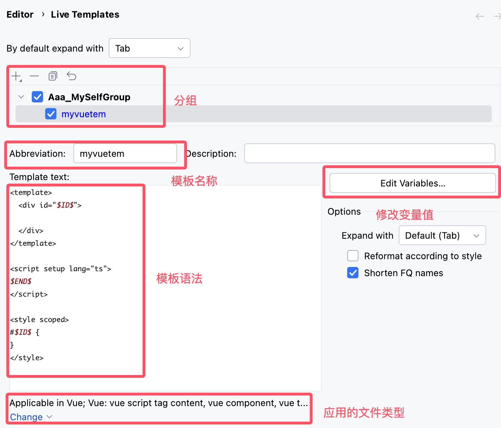
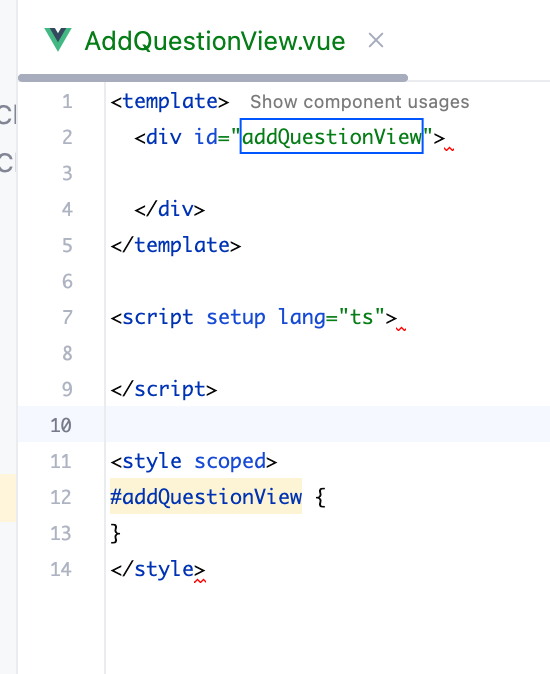

# idea配置模板语法

1. 打开idea，进入设置，搜索Live Templates

2. 点击右侧的+号，选择Template Group，创建一个自己的分组

3. 再次点击右侧的+号，选择Live Template

4. 在Abbreviation中输入模板的缩写，在Template text中输入模板的内容，点击Apply，点击OK

实例模板内容
```vue
<template>
  <div id="$ID$"></div>
</template>

<script setup lang="ts">
$END$
</script>

<style scoped>
#$ID$ {
}
</style>
```
注意：$ID$是模板的占位符，在输入模板缩写后，按Tab键，占位符会被自动替换为光标所在的位置
在Edit Variables中，点击+号，$ID$的Expression中输入camelCase(fileNameWithoutExtension())，点击Apply，点击OK


5. 新建一个vue文件，在文件里面输入模板的缩写，然后按Tab键，模板的内容就会自动补全

